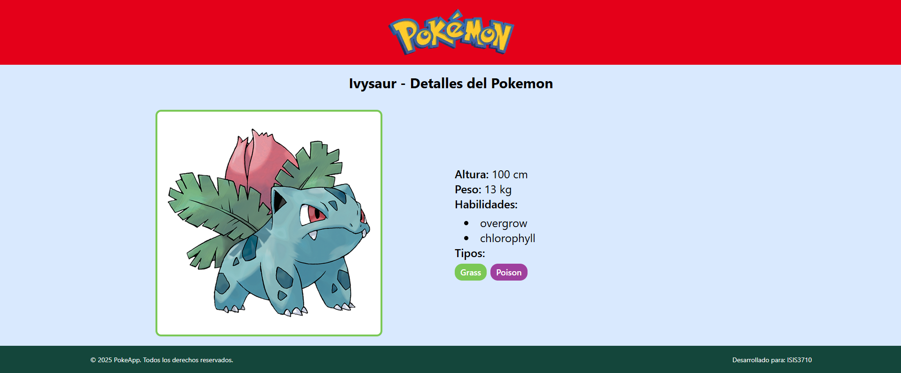

# Programación con tecnologías web - ISIS3710

## Instrucciones generales

1. Lea todas las instrucciones antes de comenzar.
2. Realice un fork de este repositorio en su cuenta de GitHub.
3. Desarrolle el proyecto utilizando Next.js.
4. Estilice el proyecto con Tailwind CSS, salvo que sea estrictamente necesario aplicar estilos en CSS puro para un caso particular.
5. Genere un release **ANTES** de las 6:30 pm del 23 de Septiembre del 2025 (Release que no se haya generado dentro de esta franaja de horario y día indicado no será tenido en cuenta en la calificación final).
6. Envíe la URL del repositorio a través de BloqueNeón (**ASEGURESE** que el repositorio sea **público**).

## Descripción

Se solicita el desarrollo de una demo de una Pokédex correspondiente a la primera generación de Pokémon. El objetivo es crear un MVP de la aplicación, priorizando el diseño y la parte gráfica.
Para esta demo, se deben implementar dos pantallas principales:

* Home: Listado de Pokémon.
* Detalle: Información individual de cada Pokémon.

La aplicación debe construirse tomando como base el proyecto disponible en este repositorio.

## 1. Preparcial (20%)

El jueves 18 de septiembre de 2025 se publicó en BloqueNeón el PDF con las indicaciones del preparcial. La entrega del mismo debía realizarse el domingo 21 de septiembre de 2025. Este preparcial corresponde al 20% de la nota del parcial.

## 2. Páginas (70%)

### P0. Layout

#### Estructura:

El layout debe tener la siguiente estructura:

```html
<html lang="en">
    <body>
        <NextIntlClientProvider>
            <header></header>
            <main>
                {children}
            </main>
            <footer><footer>
        </NextIntlClientProvider>
    </body>
</html>
```

De acuerdo con esta estructura, deben crear un componente en `src/components` tanto para el Header como para el Footer. Al basarse en este layout, se deben tener en cuenta varios aspectos:
1. Este layout debe estar presente tanto en el Home cómo en el Detalle
2. Los componentes de Header y Footer deben tener las etiquetas de HTML5 correspondientes a estas secciones
3. El componente de Header debe tener de manera centrada el logo de Pokémon.
4. El componente de Footer debe tener los legales que aparecen en el mockup del Home.
5. Deben agregar los metadatos de título y descripción en las dos páginas:
    * Home: 

    | Título | Descripción |
    | ------ | ----------- |
    | Pokedex Nacional - PokeApp | Explora la Pokédex de la primera generación: un listado completo de Pokémon con sus características y detalles principales. |
    
    * Detalle:

    | Título | Descripción |
    | ------ | ----------- |
    | Detalle del Pokémon - PokeApp | Consulta información detallada de cada Pokémon: estadísticas, tipos, habilidades y otros datos relevantes de la primera generación. |

#### Assets
* Logo: El logo se encuentra en el directorio `public/pokemon-logo.png`
* Colores:
    * Fondo del Header: #E71309
    * Fondo del Footer: #11463B
    * Fondo del Main: #11463B

### P1. Home (40%)

#### Estructura

Cuando el usuario ingrese a la plataforma se debe mostrar un listado completo de los pokemones del 1 al 15 usando PokeAPI(https://pokeapi.co/). La pantalla se debe ver idéntica al siguiente mockup:


Se requieren al menos dos componentes:

1. Componente de lista de Pokémon: obtiene los primeros 15 Pokémon de la API (`https://pokeapi.co/api/v2/pokemon?limit=15`) y recorre la lista para mostrar su información.

2. Componente card de Pokémon: para cada Pokémon muestra su nombre, imagen y tipo principal, y aplica un borde con el color correspondiente a su tipo.

#### Assets
* Imágenes: Las imágenes de cada Pokémon se pueden obtener desde la siguiente URL:
    * `https://raw.githubusercontent.com/PokeAPI/sprites/master/sprites/pokemon/other/official-artwork/<idPoke>.png`

    Donde `<idPoke>` corresponde al número de la Pokédex del Pokémon. Solo es necesario reemplazar el `<idPoke>` del Pokémon al final de la URL para obtener la imagen correspondiente.

    Si no logran usar esta imagen, la API también trae unas imagenes de los Pokémon en una llave llamada `sprites`.
* Colores:

    ```ts
        //Colores del Background para Tailwind
        const BgColorTypes = {
            bug: 'bg-[#a8b820]',
            dark: 'bg-[#705848]',
            dragon: 'bg-[#7038f8]',
            electric: 'bg-[#f8d030]',
            fairy: 'bg-[#f0a6f7]',
            fighting: 'bg-[#c03028]',
            fire: 'bg-[#f08030]',
            flying: 'bg-[#a890f0]',
            ghost: 'bg-[#705898]',
            grass: 'bg-[#78c850]',
            ground: 'bg-[#e0c068]',
            ice: 'bg-[#98d8d8]',
            normal: 'bg-[#a8a878]',
            poison: 'bg-[#a040a0]',
            psychic: 'bg-[#f85888]',
            rock: 'bg-[#b8a038]',
            water: 'bg-[#6890f0]',
        }
        //Colores del Border para Tailwind
        const BorderColorTypes = {
            bug: 'border-[#a8b820]',
            dark: 'border-[#705848]',
            dragon: 'border-[#7038f8]',
            electric: 'border-[#f8d030]',
            fairy: 'border-[#f0a6f7]',
            fighting: 'border-[#c03028]',
            fire: 'border-[#f08030]',
            flying: 'border-[#a890f0]',
            ghost: 'border-[#705898]',
            grass: 'border-[#78c850]',
            ground: 'border-[#e0c068]',
            ice: 'border-[#98d8d8]',
            normal: 'border-[#a8a878]',
            poison: 'border-[#a040a0]',
            psychic: 'border-[#f85888]',
            rock: 'border-[#b8a038]',
            water: 'border-[#6890f0]',
        }
    ```

### P2. Detalle (30%)

#### Estructura

Al hacer clic en un Pokémon de la lista en la página de inicio, se debe mostrar una pantalla de detalle del Pokémon que incluya:

* Altura (en centímetros)
* Peso (en kilogramos)
* Listado de habilidades
* Tipos del Pokémon. 

Para obtener la información del Pokémon, se utiliza el endpoint `https://pokeapi.co/api/v2/pokemon/<idPoke>`, donde `<idPoke>` corresponde al número de la Pokédex del Pokémon. La pantalla se debe ver idéntica al siguiente mockup:



Se debe implementar al menos un componente encargado del detalle del Pokémon, que muestre tanto la imagen como la información adicional.

#### Assets

Utilice los mismos recursos (imágenes, colores y demás assets) proporcionados para la página de inicio.

## 3. I18N (10%)

Los labels estáticos de la aplicación deben ser internacionalizables. Asegúrese de soportar al menos dos idiomas (inglés y español).

Este proyecto ya tiene configurado el I18N por lo tanto solo debe realizar la debida traducción de los labels.

<hr>

# NO OLVIDE REALIZAR UN RELEASE ANTES DE FINALIZAR LA HORA DEL PARCIAL